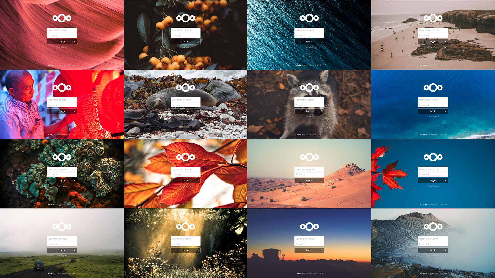
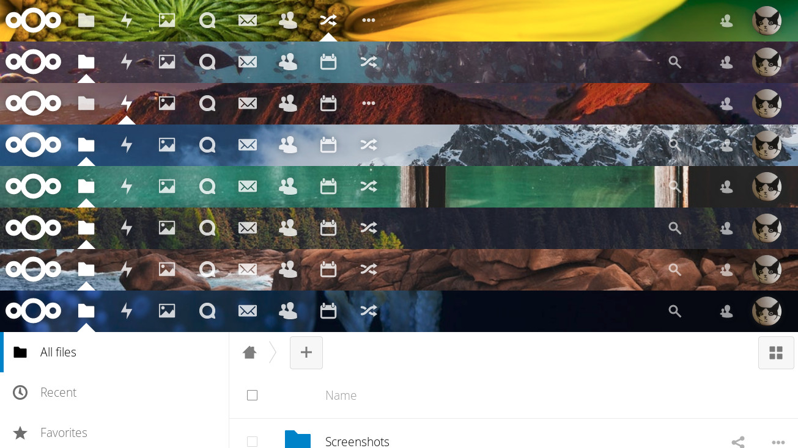

# Splash - Random [Nextcloud](https://nextcloud.com) backgrounds!

[](https://github.com/nextcloud/unsplash/blob/master/LICENSE.md) [](https://github.com/nextcloud/unsplash/releases) [](https://github.com/nextcloud/unsplash/releases/latest)


Show a new colorful image on your Loginscreen every day!

## Screenshots
<table>
  <tr style="border:none">
    <td style="border:none">
      
    </td>
    <td style="border:none">
      
    </td>
    <td style="border:none">
      
    </td>
  </tr>
</table>


## Features
| Provider                                                                                           |
|:---------------------------------------------------------------------------------------------------|
| Nextcloud Background                                                                               |
| [Unsplash API](https://unsplash.com/developers)                                                    |
| [WallhavenCC](https://wallhaven.cc)                                                                |
| [Wikimedia](https://commons.wikimedia.org/wiki/Main_Page)                                          |
| [Wikimedia Picture of the Day](https://commons.wikimedia.org/wiki/Commons:Picture_of_the_day)      |
| [Bing Wallpaper Picture of the Day](https://bingwallpaper.microsoft.com/mac/en/bing/bing-wallpaper) |


## Settings


## Contributing
Anyone is welcome to contribute and help out. However, hate, discrimination and racism are decidedly unwelcome here. If you feel offended by this, you might belong to the group of people who are not welcome. I will not tolerate hate in any way.

If you want to add more translations, see [transifex](https://explore.transifex.com/nextcloud/nextcloud/)!

Thanks to all the people wo helped out!

## Developing

You should first make sure you have a nextcloud installation up and running.
Then you can link this app into the appfolder:
```sh
# Link 
ln ./ /var/www/html/nextcloud
# Or wherever your cloud is.
```

## License
This app is released under the terms of the [AGPLv3 license](https://github.com/nextcloud/unsplash/blob/master/LICENSE.md).

## About this app

Conception: [Jan C. Borchardt](https://github.com/jancborchardt/) and [Lukas Reschke](https://github.com/LukasReschke)

Maintenance and development: [Felix Nüsse](https://github.com/newhinton)